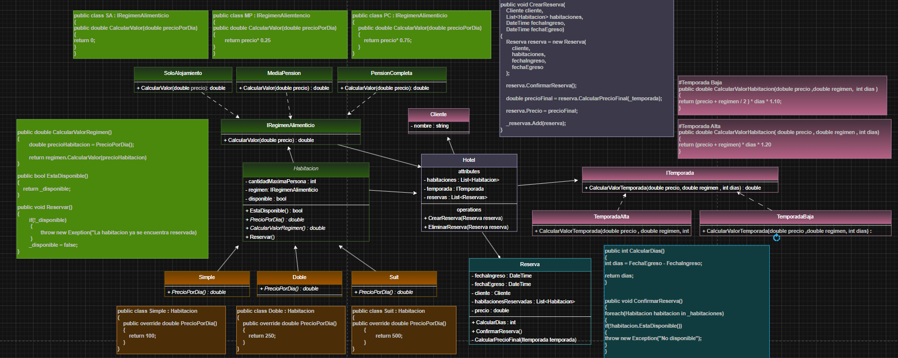

# 📚 Programación 2 - Repaso y Práctica

Repositorio dedicado al repaso y práctica de los principales conceptos vistos en **Programación 2**, utilizando **C# y .NET**.

El objetivo es reforzar los fundamentos de la Programación Orientada a Objetos, estructuras de datos, principios de diseño y patrones de diseño mediante ejercicios prácticos.

---
## 📐 Diagrama UML

<p align="center">
  
</p>

---
## 🧠 Contenidos

### 1. Programación Orientada a Objetos (POO)

Repaso de los principales conceptos de la programación orientada a objetos:

- Diagrama de clases(UML)
- Clases y objetos
- Atributos y propiedades
- Constructores
- Encapsulamiento
- Métodos
- Herencia
- Polimorfismo
- Clases abstractas
- Métodos abstractos
- Interfaces
- Sobrecarga y sobreescritura de métodos
- Composición y agregación

---

### 2. Estructuras de Datos Dinámicas

Práctica de estructuras de datos dinámicas y su utilización mediante clases.

#### 📦 Pilas (Stack)

- Concepto LIFO
- `Push`
- `Pop`
- `Peek`
- Recorrido y manipulación de elementos
- Implementación y utilización de pilas

#### 🚶 Colas (Queue)

- Concepto FIFO
- `Enqueue`
- `Dequeue`
- `Peek`
- Recorrido y manipulación de elementos
- Implementación y utilización de colas

---

### 3. Principios SOLID

Aplicación de los principios SOLID para desarrollar código más mantenible, flexible y escalable.

- **S** - Single Responsibility Principle (SRP)
- **O** - Open/Closed Principle (OCP)
- **L** - Liskov Substitution Principle (LSP)
- **I** - Interface Segregation Principle (ISP)
- **D** - Dependency Inversion Principle (DIP)

---

### 4. Patrones de Diseño

Repaso y aplicación práctica de patrones de diseño orientados a resolver problemas comunes de diseño de software.

#### Creacionales

- Singleton
- Factory Method
- Abstract Factory
- Builder

#### Estructurales

- Adapter
- Facade
- Composite
- Decorator

#### Comportamiento

- Strategy
- Template Method
- Observer

---

## 🛠️ Tecnologías

- C#
- .NET
- Visual Studio Code
- Git
- GitHub

---

## 🎯 Objetivo

Este repositorio forma parte de mi práctica continua como desarrollador y tiene como objetivo:

- Reforzar fundamentos de Programación Orientada a Objetos.
- Mejorar la resolución de problemas mediante ejercicios prácticos.
- Comprender y aplicar estructuras de datos.
- Aplicar principios SOLID.
- Comprender cuándo y cómo utilizar patrones de diseño.
- Mantener una base de consulta para futuros proyectos.

---

## 📁 Organización

El contenido se encuentra organizado por temas:

```text
Programacion-2-Repaso/
│
├── 01-POO/
├── 02-Estructuras-Dinamicas/
│   ├── Pilas/
│   └── Colas/
│
├── 03-SOLID/
│
├── 04-Patrones-de-Diseno/
│   ├── Creacionales/
│   ├── Estructurales/
│   └── Comportamiento/
│
└── README.md